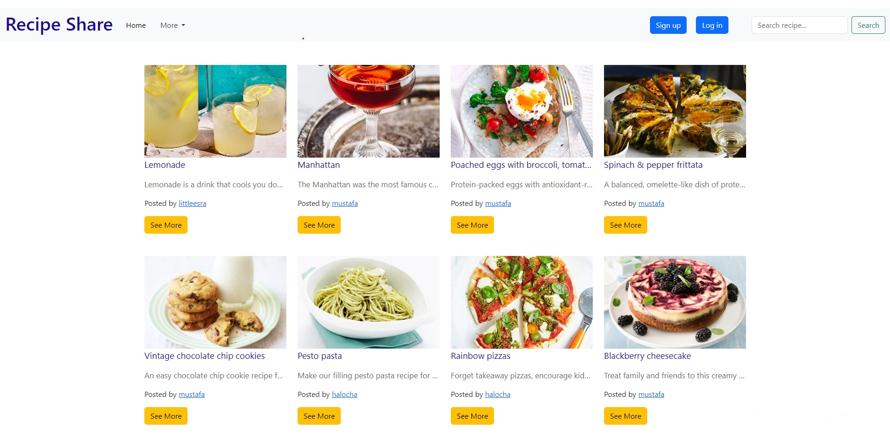
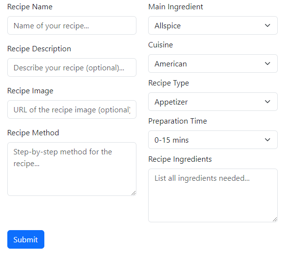
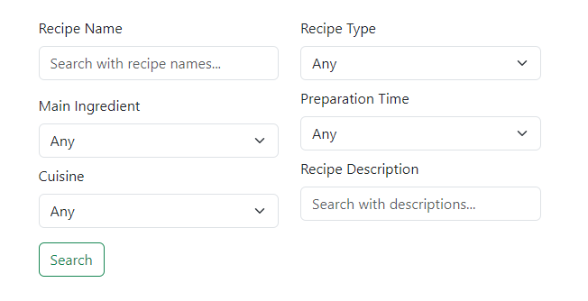

# recipe-share
Django app for sharing and searching recipes.

## Screenshot

## Demo
👉 See it live [here](https://recipe-share-cmv8.onrender.com)

## Features

- `User Authentication:` Users can create an account, securely login/logout

- `Recipe Management:` Authorized users can create new recipes, update existing recipes, and delete recipes that they have created.

- `User Profiles:` Click on usernames to view users recipes.

-  `Basic Search:` Users can search for recipes by name using the basic search feature.

-  `Advanced Search:` Users can perform more complex queries to find recipes based on various criteria such as cuisine, preparation time, main ingredient and recipe type.

## User guide

### Creating Recipes

- After logging in, you'll find an option to "Create Recipe" on your dashboard
- Fill in the recipe details, including the name, ingredients, method, recipe type, preperation time, cuisine, main ingredient and an optional image and description.
- Click on the "Submit" button to publish your recipe.

### Basic Search
- On the homepage, you'll find a search bar.
- Enter the name of the recipe you're looking for and press "Enter."
- The search results will display matching recipes.

### Advanced Search
- On the homepage, click on the "More" dropdown menu and choose the "Advanced Search" option.
- Specify your search criteria, such as cuisine type, preparation time, and more.
- Click on the "Search" button to see recipes that match your criteria.

